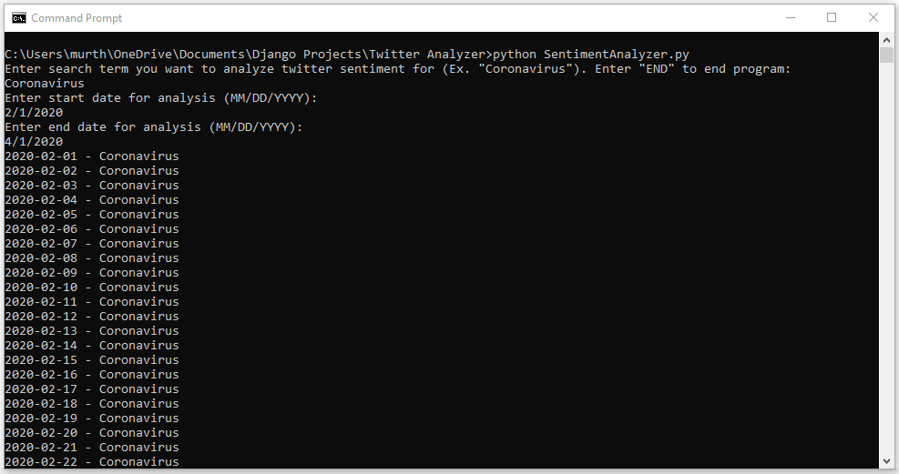
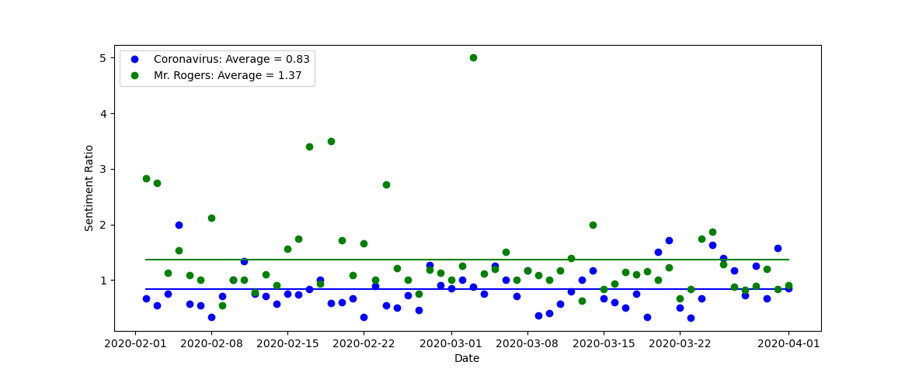

# Twitter Sentiment Analyzer
## Project Introduction

This project is a twitter analysis tool that calculates sentiment about a topic by searching tweets for commonly used positive and negative connotative words. 

## Prerequisites

You will need a way to run the program which is written in Python. The Command Prompt on any Windows device should be sufficient.

## Installation

1. Clone the project repository to your local machine. (https://github.com/rnmurthy1996/Twitter-Sentiment-Analyzer.git)
2. Open command prompt, change your directory to the project repository, and enter the following command to launch the program:

```
python SentimentAnalyzer.py
```

## Using Application
When the program is run, the user will be prompted to enter a query that they want to analyze the sentiment for and a start and end date for their analysis.


The program will then analyze the sentiment for the query and ask the user for another query if they wish to do so. A maximum of 4 queries are allowed.
Once the user terminates the program, a scratterplot with the sentiment analysis results will pop up.


## Built With
* Atom - Source code editor used for development
* GetOldTweets3 - Python library used to scrape twitter data
* Matplotlib - Python library used for data visualization

## Authors
Rohan Murthy  
